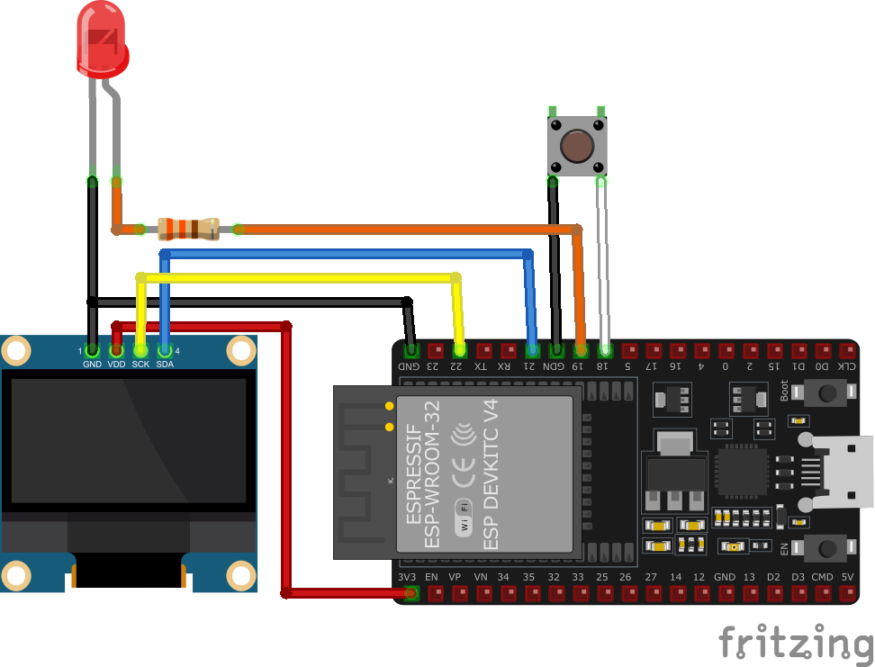

## Description
This project monitors the number of online players on Rucoy Online servers. The application fetches data from the official server list, sorts servers by player count, and displays the top or bottom four servers on a 128x64 SSD1306 OLED screen.

Data source is 'https://www.rucoyonline.com/server_list.json'

## Features
- The data refreshes automatically.
- LED on pin 19 blinks as the data is refreshed.
- A button allows switching between the top 4 and bottom 4 crowded servers.

## Important
Insert your Wifi SSID and Password before uploading code to ESP32.

## Materials Used
- ESP32-WROOM-32D
- 128x64 0.96" SSD1306 I2C OLED Display
- 1x LED in your favourite colour
- 1x 330Ω Resistor
- 1x Generic Push Button

## Alternative Python Version
If you prefer to run the monitor on your PC, a Python script (Crowd Monitor.py) is available. Ensure Python is installed. Download and double-click the script to run it.
